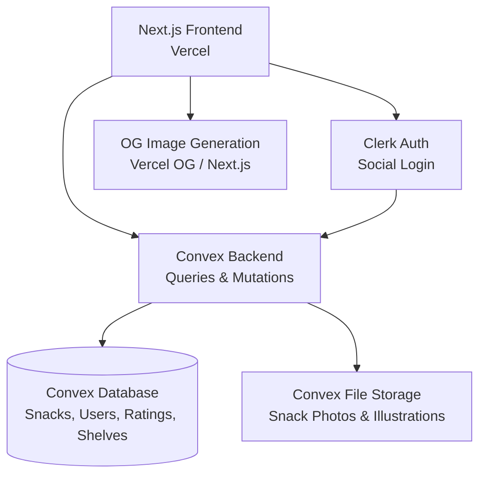

# PRD — Konbini Scout

## 1. Overview

### Product Summary

**Konbini Scout** — "Your guide to the best Asian snacks you haven't tried yet."

Konbini Scout is a visual snack discovery platform that lets Western snack explorers browse Asian snacks on an illustrated shelf, rate them with lucky cats, build personal Top 5 shelves, and share curated recommendations with friends. The core experience is structured browsing (savoury/sweet → flavour/maker → shelf of 5) that replaces overwhelming choice with playful, constrained discovery.

### Objective

This PRD covers the MVP as defined in the product vision: a web application that delivers the full discovery-to-sharing loop. Users can browse the snack database via the savoury/sweet → flavour/maker funnel, view illustrated shelves of 5, read snack detail pages, create accounts, rate snacks with lucky cats, build personal shelves, create and share custom shelves, and view community aggregate shelves. An admin interface allows Troy to add and manage snack content.

### Market Differentiation

The technical implementation must deliver three things that no competitor offers: (1) an illustrated shelf display that renders 5 snacks as visual products on a virtual shelf surface — this is the signature UI element and must feel like a physical shelf, not a card grid; (2) flavour-first navigation that starts with savoury/sweet and drills into flavour categories or makers; (3) constrained curation where every shelf is exactly 5 items, making the format consistent, shareable, and low-barrier.

### Magic Moment

The magic moment is opening a shared shelf link and seeing 5 illustrated snacks on a beautiful shelf with lucky cat ratings. This must load instantly (no auth wall, no loading spinner visible for more than 200ms), render the illustrated shelf as the hero element, and generate a compelling Open Graph preview card when shared on social media. The entire shared shelf page must work for unauthenticated users.

### Success Criteria

- Time from landing to seeing first shelf: < 10 seconds (including 3 taps)
- Shared shelf page load (LCP): < 1.5 seconds
- Sign-up to first rating: < 60 seconds
- All P0 features functional
- Open Graph preview cards render correctly on Instagram, Twitter/X, Facebook, iMessage, and WhatsApp
- Admin can add a new snack in < 5 minutes

---

## 2. Technical Architecture

### Architecture Overview



### Chosen Stack

| Layer | Choice | Rationale |
|---|---|---|
| Frontend | Next.js | SEO for shared shelf links, React for interactive shelf/rating features, excellent Convex integration |
| Backend | Convex | Real-time reactive queries for live community shelves and ratings, zero backend boilerplate, TypeScript end-to-end |
| Database | Convex Database | Included with Convex, reactive queries, handles relational data for snacks/makers/flavours/ratings |
| Auth | Clerk | Pre-built social login components, near-zero sign-up friction, first-class Convex integration |
| Payments | None | Skipped for MVP — passion project first, Stripe integration planned for snack box phase |

### Stack Integration Guide

**Setup order:**
1. Create Next.js project with App Router and TypeScript
2. Install and configure Convex (npx convex dev starts the backend)
3. Set up Clerk application (dashboard.clerk.com) with Google and Apple social providers
4. Install @clerk/nextjs and configure the Clerk provider in the root layout
5. Install convex and configure the Convex provider, wrapping it inside the Clerk provider
6. Configure Clerk webhook to sync user data to Convex (Clerk → Convex user record)
7. Set up Tailwind CSS with custom design tokens from the product vision
8. Configure Next.js metadata and Open Graph image generation for shared shelf URLs

**Known integration patterns:**
- Clerk + Convex: Use the `@clerk/nextjs` provider wrapping the `ConvexProviderWithClerk` component. Convex functions access the authenticated user via `ctx.auth.getUserIdentity()`.
- Convex file storage: Use `ctx.storage.getUrl()` for serving snack images. Store the storage ID in the snack record, generate the URL at query time.
- Next.js App Router + Convex: Use `useQuery` and `useMutation` hooks from `convex/react` in client components. Server components can use `fetchQuery` for initial data.

**Common gotchas:**
- Clerk webhook must be configured before user data will sync to Convex. Set up the webhook endpoint early.
- Convex schema changes require running `npx convex dev` to push. Schema must be defined before writing functions that reference tables.
- Next.js dynamic routes for shared shelves (`/shelf/[id]`) need proper metadata generation for OG previews — use `generateMetadata` in the page component.
- Convex file URLs are temporary by default. For stable image URLs (needed for OG images), use `ctx.storage.getUrl()` in a query and cache appropriately.

**Required environment variables:**
```
NEXT_PUBLIC_CONVEX_URL=           # Convex deployment URL
NEXT_PUBLIC_CLERK_PUBLISHABLE_KEY= # Clerk publishable key
CLERK_SECRET_KEY=                  # Clerk secret key
CONVEX_DEPLOY_KEY=                 # For production deployment
CLERK_WEBHOOK_SECRET=              # For Clerk → Convex user sync
```

### Repository Structure

```
konbini-scout/
├── src/
│   ├── app/                       # Next.js App Router
│   │   ├── layout.tsx             # Root layout with Clerk + Convex providers
│   │   ├── page.tsx               # Homepage — savoury/sweet entry point
│   │   ├── browse/
│   │   │   ├── [category]/        # Savoury or sweet
│   │   │   │   ├── page.tsx       # Flavour/maker selection
│   │   │   │   ├── flavour/
│   │   │   │   │   └── [flavour]/
│   │   │   │   │       └── page.tsx  # Shelf display for flavour
│   │   │   │   └── maker/
│   │   │   │       └── [maker]/
│   │   │   │           └── page.tsx  # Shelf display for maker
│   │   ├── snack/
│   │   │   └── [id]/
│   │   │       └── page.tsx       # Snack detail page
│   │   ├── shelf/
│   │   │   ├── [id]/
│   │   │   │   └── page.tsx       # Shared shelf view (public)
│   │   │   ├── create/
│   │   │   │   └── page.tsx       # Create shared shelf
│   │   │   └── my/
│   │   │       └── page.tsx       # Personal shelves dashboard
│   │   ├── admin/
│   │   │   ├── page.tsx           # Admin dashboard
│   │   │   └── snacks/
│   │   │       ├── new/
│   │   │       │   └── page.tsx   # Add new snack
│   │   │       └── [id]/
│   │   │           └── page.tsx   # Edit snack
│   │   └── api/
│   │       ├── clerk-webhook/
│   │       │   └── route.ts       # Clerk → Convex user sync
│   │       └── og/
│   │           └── route.tsx      # OG image generation for shelves
│   ├── components/
│   │   ├── ui/                    # Design system primitives
│   │   │   ├── Button.tsx
│   │   │   ├── Card.tsx
│   │   │   ├── Input.tsx
│   │   │   ├── Badge.tsx
│   │   │   ├── CategoryPill.tsx
│   │   │   └── Modal.tsx
│   │   ├── shelf/                 # Shelf-specific components
│   │   │   ├── ShelfDisplay.tsx   # The core illustrated shelf of 5
│   │   │   ├── ShelfItem.tsx      # Single illustrated snack on shelf
│   │   │   ├── ShelfSurface.tsx   # The wooden shelf background
│   │   │   ├── ShelfComparison.tsx # My shelf vs community shelf
│   │   │   └── SharedShelfCard.tsx # Shelf preview for sharing
│   │   ├── snack/                 # Snack-related components
│   │   │   ├── SnackDetail.tsx    # Full snack detail view
│   │   │   ├── SnackPhoto.tsx     # Real product photo display
│   │   │   └── SnackDescription.tsx
│   │   ├── rating/                # Rating components
│   │   │   ├── LuckyCatRating.tsx # The 1-5 lucky cat rating display
│   │   │   ├── LuckyCatInput.tsx  # Interactive rating input
│   │   │   └── LuckyCat.tsx       # Individual cat (happy/neutral/grumpy)
│   │   ├── navigation/            # Browse navigation
│   │   │   ├── CategoryToggle.tsx # Savoury/Sweet toggle
│   │   │   ├── FlavourGrid.tsx    # Flavour category browser
│   │   │   └── MakerGrid.tsx      # Maker browser
│   │   └── layout/                # Layout components
│   │       ├── Header.tsx
│   │       ├── Footer.tsx
│   │       └── PageContainer.tsx
│   ├── lib/                       # Utilities
│   │   ├── utils.ts               # General helpers
│   │   └── constants.ts           # Category lists, config values
│   └── styles/
│       └── globals.css            # Global styles, CSS variables, font imports
├── convex/                        # Convex backend
│   ├── schema.ts                  # Database schema definition
│   ├── snacks.ts                  # Snack queries and mutations
│   ├── ratings.ts                 # Rating queries and mutations
│   ├── shelves.ts                 # Shelf queries and mutations
│   ├── users.ts                   # User queries and mutations
│   ├── makers.ts                  # Maker queries
│   ├── flavours.ts                # Flavour queries
│   ├── admin.ts                   # Admin-only mutations
│   └── http.ts                    # HTTP routes (Clerk webhook)
├── public/
│   ├── illustrations/             # Snack illustrations (SVG/PNG)
│   ├── lucky-cats/                # Lucky cat rating icons
│   │   ├── happy.svg              # 4-5 rating
│   │   ├── neutral.svg            # 3 rating
│   │   └── grumpy.svg             # 1-2 rating
│   └── shelf/                     # Shelf surface textures
├── tailwind.config.ts             # Custom design tokens
├── next.config.ts                 # Next.js configuration
├── convex.config.ts               # Convex configuration
└── .env.local                     # Environment variables (gitignored)
```

### Infrastructure & Deployment

**Frontend:** Deploy to Vercel (free tier supports the MVP). Vercel is the path of least resistance for Next.js — zero-config deployment, automatic preview deployments on PRs, built-in analytics.

**Backend:** Convex Cloud (free tier: 1M function calls/month, 1GB storage). Convex deploys automatically when running `npx convex deploy` or via CI.

**CI/CD:** GitHub Actions for lint/type-check on PRs. Vercel handles frontend deployment on push to main. Convex deployment can be added to the GitHub Actions workflow.

**Environment variables needed:**
- Vercel: All env vars from the list above, set in the Vercel dashboard
- Convex: `CLERK_WEBHOOK_SECRET` set via `npx convex env set`
- Local: `.env.local` for development

### Security Considerations

**Authentication:** Clerk handles all auth flows. Users authenticate via Google or Apple social login — no password storage. Clerk JWTs are verified by Convex on every authenticated request.

**Authorization:** Convex mutations check `ctx.auth.getUserIdentity()` before any write operation. Admin mutations additionally check a user role field. Public queries (browse, view shared shelf) do not require auth.

**Data protection:** User data is minimal (name, email from social provider, ratings, shelves). No sensitive personal data beyond what Clerk stores. Convex encrypts data at rest.

**Input validation:** All Convex mutations use `v.` validators for argument types. Snack descriptions and shelf names are sanitised for XSS before rendering.

**Rate limiting:** Convex has built-in rate limiting on function calls. Additional rate limiting on the rating endpoint to prevent spam (max 50 ratings per user per hour).

### Cost Estimate

| Service | Free Tier | Estimated Monthly Cost (< 1000 users) |
|---|---|---|
| Vercel | 100GB bandwidth, unlimited deployments | $0 |
| Convex | 1M function calls, 1GB storage | $0 (within free tier) |
| Clerk | 10,000 MAU | $0 (within free tier) |
| Domain | N/A | ~$12/year (~$1/month) |
| **Total** | | **~$1/month** |

The MVP runs effectively free until reaching significant scale. Convex Pro ($25/month) and Clerk Pro ($25/month) would be needed around 5,000-10,000 users.

---

## 3. Data Model

### Entity Definitions

```typescript
// snacks table
{
  name: v.string(),                    // Display name, e.g. "Calbee Shrimp Chips"
  slug: v.string(),                    // URL-safe identifier, e.g. "calbee-shrimp-chips"
  makerId: v.id("makers"),             // Reference to maker
  description: v.string(),            // Enthusiastic snack description (the voice)
  flavourNotes: v.string(),           // Specific flavour description
  category: v.union(v.literal("savoury"), v.literal("sweet")),
  flavourIds: v.array(v.id("flavours")),  // Can belong to multiple flavour categories
  illustrationStorageId: v.optional(v.id("_storage")), // Illustrated shelf image
  photoStorageId: v.optional(v.id("_storage")),        // Real product photo
  averageRating: v.number(),          // Cached average (0-5), updated on new ratings
  totalRatings: v.number(),           // Cached count, updated on new ratings
  isPublished: v.boolean(),           // Admin toggle — only published snacks appear in browse
  createdAt: v.number(),              // Unix timestamp ms
  updatedAt: v.number(),              // Unix timestamp ms
}

// makers table
{
  name: v.string(),                    // e.g. "Calbee", "Kasugai", "Lotte"
  slug: v.string(),                    // URL-safe identifier
  country: v.string(),                 // Country of origin, e.g. "Japan", "South Korea"
  description: v.optional(v.string()), // Brief maker description
  logoStorageId: v.optional(v.id("_storage")), // Maker logo
  snackCount: v.number(),             // Cached count of published snacks
  createdAt: v.number(),
}

// flavours table
{
  name: v.string(),                    // e.g. "Matcha", "Spicy", "Strawberry", "Wasabi"
  slug: v.string(),                    // URL-safe identifier
  category: v.union(v.literal("savoury"), v.literal("sweet"), v.literal("both")),
  description: v.optional(v.string()), // Brief flavour description
  iconEmoji: v.optional(v.string()),   // Visual indicator, e.g. "🍵" for matcha
  snackCount: v.number(),             // Cached count of published snacks in this flavour
  createdAt: v.number(),
}

// users table
{
  clerkId: v.string(),                 // Clerk user ID (from webhook)
  name: v.string(),                    // Display name from social provider
  imageUrl: v.optional(v.string()),    // Avatar URL from social provider
  role: v.union(v.literal("user"), v.literal("admin")),
  totalRatings: v.number(),           // Cached count
  createdAt: v.number(),
}

// ratings table
{
  userId: v.id("users"),               // Who rated
  snackId: v.id("snacks"),             // What was rated
  score: v.number(),                   // 1-5 (maps to lucky cat states)
  createdAt: v.number(),
  updatedAt: v.number(),
}

// sharedShelves table
{
  userId: v.id("users"),               // Creator
  title: v.string(),                   // e.g. "Troy's Spicy Picks"
  description: v.optional(v.string()), // Optional shelf description
  snackIds: v.array(v.id("snacks")),   // Exactly 5 snack IDs
  slug: v.string(),                    // URL-safe unique slug for sharing
  viewCount: v.number(),              // Track views for analytics
  createdAt: v.number(),
  updatedAt: v.number(),
}
```

### Relationships

| Relationship | Type | Description |
|---|---|---|
| Snack → Maker | Many-to-1 | Each snack belongs to one maker. `snacks.makerId` references `makers._id` |
| Snack → Flavours | Many-to-many | A snack can have multiple flavour tags. `snacks.flavourIds` is an array of `flavours._id` |
| Rating → User | Many-to-1 | Each rating belongs to one user. `ratings.userId` references `users._id` |
| Rating → Snack | Many-to-1 | Each rating is for one snack. `ratings.snackId` references `snacks._id` |
| SharedShelf → User | Many-to-1 | Each shared shelf is created by one user. `sharedShelves.userId` references `users._id` |
| SharedShelf → Snacks | Many-to-many | Each shared shelf contains exactly 5 snacks. `sharedShelves.snackIds` is an array of `snacks._id` |

**Unique constraint:** A user can only have one rating per snack. Enforced in the rating mutation — if a rating exists for (userId, snackId), update it rather than creating a duplicate.

### Indexes

```typescript
// snacks table indexes
.index("by_maker", ["makerId"])                    // Browse by maker
.index("by_category", ["category", "averageRating"]) // Browse savoury/sweet, sorted by rating
.index("by_slug", ["slug"])                        // URL lookups
.index("by_published", ["isPublished"])            // Filter published only

// ratings table indexes
.index("by_user", ["userId"])                      // Get all ratings for a user
.index("by_snack", ["snackId"])                    // Get all ratings for a snack
.index("by_user_snack", ["userId", "snackId"])     // Check if user rated a snack (unique constraint)

// sharedShelves table indexes
.index("by_user", ["userId"])                      // Get all shelves by a user
.index("by_slug", ["slug"])                        // URL lookups for shared links

// makers table indexes
.index("by_slug", ["slug"])                        // URL lookups

// flavours table indexes
.index("by_category", ["category"])                // Filter by savoury/sweet/both
.index("by_slug", ["slug"])                        // URL lookups
```

---

## 4. API Specification

### API Design Philosophy

Convex uses a query/mutation model rather than REST endpoints. Queries are reactive — the UI updates automatically when underlying data changes. Mutations are transactional. All functions use Convex's built-in argument validation.

Authentication is handled via Clerk JWT, accessed in Convex functions through `ctx.auth.getUserIdentity()`. Public queries (browsing, viewing shared shelves) do not require authentication.

### Endpoints

```typescript
// ─── SNACK QUERIES ───

// Get snacks by category and flavour (for shelf display)
query("snacks.byFlavour", {
  args: {
    category: v.union(v.literal("savoury"), v.literal("sweet")),
    flavourSlug: v.string(),
    limit: v.optional(v.number()),  // Default 5
  },
  returns: v.array(snackWithMakerShape),
  // Returns top 5 snacks by averageRating for the given category + flavour
})

// Get snacks by maker (for shelf display)
query("snacks.byMaker", {
  args: {
    makerSlug: v.string(),
    category: v.optional(v.union(v.literal("savoury"), v.literal("sweet"))),
    limit: v.optional(v.number()),  // Default 5
  },
  returns: v.array(snackWithFlavoursShape),
  // Returns top 5 snacks by averageRating for the given maker
})

// Get single snack by slug (for detail page)
query("snacks.bySlug", {
  args: { slug: v.string() },
  returns: v.union(snackFullShape, v.null()),
  // Returns full snack data including maker, flavours, image URLs
})

// Get single snack by ID
query("snacks.byId", {
  args: { id: v.id("snacks") },
  returns: v.union(snackFullShape, v.null()),
})

// ─── FLAVOUR QUERIES ───

// Get all flavours for a category
query("flavours.byCategory", {
  args: {
    category: v.union(v.literal("savoury"), v.literal("sweet")),
  },
  returns: v.array(flavourShape),
  // Returns flavours that have category matching or "both", with snackCount > 0
})

// ─── MAKER QUERIES ───

// Get all makers (optionally filtered by category)
query("makers.list", {
  args: {
    category: v.optional(v.union(v.literal("savoury"), v.literal("sweet"))),
  },
  returns: v.array(makerShape),
  // Returns makers that have published snacks, optionally filtered by category
})

// ─── RATING QUERIES & MUTATIONS ───

// Get user's rating for a snack
query("ratings.userRating", {
  args: { snackId: v.id("snacks") },
  returns: v.union(v.number(), v.null()),
  // Auth required. Returns the user's score (1-5) or null if not rated.
})

// Get user's top rated snacks by category (for personal shelf)
query("ratings.myTopByCategory", {
  args: {
    category: v.union(v.literal("savoury"), v.literal("sweet")),
    flavourSlug: v.optional(v.string()),
  },
  returns: v.array(ratedSnackShape),
  // Auth required. Returns user's top 5 rated snacks in the category, sorted by score desc.
})

// Get all ratings by current user
query("ratings.myRatings", {
  args: {},
  returns: v.array(ratingWithSnackShape),
  // Auth required. Returns all ratings with snack data.
})

// Rate a snack (create or update)
mutation("ratings.rate", {
  args: {
    snackId: v.id("snacks"),
    score: v.number(),  // 1-5
  },
  returns: v.null(),
  // Auth required. Creates new rating or updates existing.
  // Updates snack.averageRating and snack.totalRatings.
  // Updates user.totalRatings.
  // Validates score is integer 1-5.
})

// ─── SHARED SHELF QUERIES & MUTATIONS ───

// Get shared shelf by slug (public, for shared links)
query("shelves.bySlug", {
  args: { slug: v.string() },
  returns: v.union(sharedShelfFullShape, v.null()),
  // Public. Returns shelf with all 5 snacks fully populated.
  // Increments viewCount.
})

// Get user's shared shelves
query("shelves.myList", {
  args: {},
  returns: v.array(sharedShelfSummaryShape),
  // Auth required. Returns all shelves created by the current user.
})

// Create a shared shelf
mutation("shelves.create", {
  args: {
    title: v.string(),
    description: v.optional(v.string()),
    snackIds: v.array(v.id("snacks")),  // Must be exactly 5
  },
  returns: v.object({ slug: v.string() }),
  // Auth required. Validates exactly 5 snack IDs.
  // Generates a unique slug from the title.
  // Returns the slug for the share URL.
})

// Delete a shared shelf
mutation("shelves.remove", {
  args: { id: v.id("sharedShelves") },
  returns: v.null(),
  // Auth required. Only the creator can delete.
})

// ─── COMMUNITY QUERIES ───

// Get community top 5 for a category + flavour
query("community.topByFlavour", {
  args: {
    category: v.union(v.literal("savoury"), v.literal("sweet")),
    flavourSlug: v.string(),
  },
  returns: v.array(snackWithRatingShape),
  // Public. Returns top 5 snacks by averageRating with sufficient ratings (>= 3).
})

// Get community top 5 for a maker
query("community.topByMaker", {
  args: { makerSlug: v.string() },
  returns: v.array(snackWithRatingShape),
  // Public. Returns top 5 snacks by averageRating with sufficient ratings (>= 3).
})

// ─── USER QUERIES ───

// Get current user profile
query("users.me", {
  args: {},
  returns: v.union(userShape, v.null()),
  // Auth required.
})

// ─── ADMIN MUTATIONS ───

// Create a new snack
mutation("admin.createSnack", {
  args: {
    name: v.string(),
    makerId: v.id("makers"),
    description: v.string(),
    flavourNotes: v.string(),
    category: v.union(v.literal("savoury"), v.literal("sweet")),
    flavourIds: v.array(v.id("flavours")),
    isPublished: v.boolean(),
  },
  returns: v.id("snacks"),
  // Auth required + admin role check.
  // Auto-generates slug from name.
  // Sets averageRating: 0, totalRatings: 0.
})

// Update a snack
mutation("admin.updateSnack", {
  args: {
    id: v.id("snacks"),
    name: v.optional(v.string()),
    makerId: v.optional(v.id("makers")),
    description: v.optional(v.string()),
    flavourNotes: v.optional(v.string()),
    category: v.optional(v.union(v.literal("savoury"), v.literal("sweet"))),
    flavourIds: v.optional(v.array(v.id("flavours"))),
    isPublished: v.optional(v.boolean()),
  },
  returns: v.null(),
  // Auth required + admin role check.
})

// Upload snack image (illustration or photo)
mutation("admin.generateUploadUrl", {
  args: {},
  returns: v.string(),
  // Auth required + admin role check.
  // Returns a Convex storage upload URL.
})

// Attach uploaded image to snack
mutation("admin.attachImage", {
  args: {
    snackId: v.id("snacks"),
    storageId: v.id("_storage"),
    imageType: v.union(v.literal("illustration"), v.literal("photo")),
  },
  returns: v.null(),
  // Auth required + admin role check.
})

// Create a maker
mutation("admin.createMaker", {
  args: {
    name: v.string(),
    country: v.string(),
    description: v.optional(v.string()),
  },
  returns: v.id("makers"),
  // Auth required + admin role check.
})

// Create a flavour
mutation("admin.createFlavour", {
  args: {
    name: v.string(),
    category: v.union(v.literal("savoury"), v.literal("sweet"), v.literal("both")),
    description: v.optional(v.string()),
    iconEmoji: v.optional(v.string()),
  },
  returns: v.id("flavours"),
  // Auth required + admin role check.
})
```

---

## 5. User Stories

### Epic: Snack Discovery

**US-001: Browse by flavour**
As Sam (primary persona), I want to browse snacks by choosing savoury/sweet and then a flavour category so that I can find snacks that match flavours I already know I like.

Acceptance Criteria:
- [ ] Given I'm on the homepage, when I tap "Savoury" or "Sweet", then I see a selection of flavour categories and maker options
- [ ] Given I've selected a category and tap a flavour (e.g. "Matcha"), then I see a shelf of 5 illustrated snacks
- [ ] Given the shelf displays, when I count the items, then there are exactly 5 (or fewer if the database has < 5 in that category)

**US-002: Browse by maker**
As Sam, I want to browse snacks by maker so that when I discover a brand I like, I can see what else they make.

Acceptance Criteria:
- [ ] Given I'm on the category page, when I choose "Browse by Maker", then I see a grid of makers
- [ ] Given I tap a maker (e.g. "Calbee"), then I see a shelf of their top 5 snacks
- [ ] Given the shelf displays, snacks are ordered by average community rating descending

**US-003: View snack detail**
As Sam, I want to tap a snack on the shelf to see its full details so that I can learn about it before deciding to try it.

Acceptance Criteria:
- [ ] Given I tap a snack on any shelf, then I see the detail page with: real product photo, enthusiastic description, flavour notes, maker info, and community lucky cat rating
- [ ] Given I'm on the detail page, the illustrated version is replaced by the real product photo
- [ ] Given the snack has ratings, the average lucky cat rating displays with the correct cat states (happy/neutral/grumpy)

### Epic: Rating & Personal Shelves

**US-004: Rate a snack**
As Sam, I want to rate a snack I've tried using lucky cats so that I can record my opinion and build my personal shelf.

Acceptance Criteria:
- [ ] Given I'm signed in and on a snack detail page, when I tap a lucky cat (1-5), then my rating is saved
- [ ] Given I've already rated this snack, my previous rating is shown and I can change it
- [ ] Given I tap 1-2 cats, the cats display as grumpy. 3 displays neutral. 4-5 display as happy waving.
- [ ] Given I'm not signed in, when I try to rate, I'm prompted to sign in via Clerk

**US-005: View my personal shelf**
As Sam, I want to see my top 5 rated snacks per category so that I can see my personal shelf take shape.

Acceptance Criteria:
- [ ] Given I've rated snacks, when I visit my shelves page, then I see my top 5 per category based on my highest ratings
- [ ] Given I have fewer than 5 ratings in a category, the shelf shows what I have with empty slots
- [ ] Given I change a rating, my personal shelf updates in real-time

### Epic: Shared Shelves

**US-006: Create a shared shelf**
As Sam, I want to create a shelf of 5 snack recommendations I can share with friends.

Acceptance Criteria:
- [ ] Given I'm signed in, when I tap "Create a Shelf", I can name it and select exactly 5 snacks
- [ ] Given I've selected 5 snacks, I see a preview of the illustrated shelf
- [ ] Given I tap "Share", I get a unique URL I can copy and share
- [ ] Edge case: selecting fewer or more than 5 snacks → the share button is disabled with a count indicator

**US-007: View a shared shelf**
As anyone (no account needed), I want to open a shared shelf link and see the shelf immediately.

Acceptance Criteria:
- [ ] Given I open a shared shelf URL, I see the illustrated shelf with 5 snacks, the shelf title, and lucky cat ratings — no sign-up required
- [ ] Given I tap a snack on the shared shelf, I navigate to its detail page
- [ ] Given the URL is shared on social media, the preview card shows the shelf title and an image of the shelf

### Epic: Community

**US-008: View community shelf**
As Sam, I want to see the community's top 5 for a category so that I can discover popular snacks I haven't tried.

Acceptance Criteria:
- [ ] Given a category has enough ratings (>= 3 ratings per snack), the community shelf appears alongside the discovery shelf
- [ ] Given I'm signed in, I can see my shelf and the community shelf side by side for comparison
- [ ] Given a category has insufficient ratings, the community shelf is hidden and only the discovery shelf shows

### Epic: Admin

**US-009: Add a new snack**
As Troy (admin), I want to add a new snack to the database quickly so that I can grow the catalogue.

Acceptance Criteria:
- [ ] Given I'm signed in as admin, I can access the admin panel
- [ ] Given I'm adding a snack, I fill in: name, select a maker, write a description and flavour notes, choose savoury/sweet, tag flavour categories, upload an illustration and a photo
- [ ] Given I save the snack, it appears in the browse results if published
- [ ] Given the process, adding a complete snack takes under 5 minutes

---

## 6. Functional Requirements

### Discovery & Browsing

**FR-001: Savoury/Sweet toggle**
Priority: P0
Description: The homepage presents a binary choice between "Savoury" and "Sweet" as the entry point to all browsing. This is the first interaction every user has.
Acceptance Criteria:
- Two large, visually distinct, illustrated options
- Tapping either navigates to the category browse page
- The toggle state persists in the URL for shareability
Related Stories: US-001

**FR-002: Flavour browsing**
Priority: P0
Description: After selecting savoury/sweet, users can choose "Browse by Flavour" which shows a grid of flavour categories relevant to their selection (e.g. savoury shows Spicy, Wasabi, Seaweed, Cheese; sweet shows Matcha, Strawberry, Melon, Chocolate).
Acceptance Criteria:
- Flavour grid shows only flavours tagged as matching the selected category (or "both")
- Each flavour shows its name, emoji icon, and snack count
- Tapping a flavour navigates to the shelf display
Related Stories: US-001

**FR-003: Maker browsing**
Priority: P0
Description: After selecting savoury/sweet, users can choose "Browse by Maker" which shows a grid of makers that have published snacks.
Acceptance Criteria:
- Maker grid shows maker name, country flag/indicator, and snack count
- Makers are sorted by snack count (most snacks first)
- Tapping a maker navigates to the shelf display
Related Stories: US-002

**FR-004: Shelf display**
Priority: P0
Description: The core UI element. Displays exactly 5 snacks as illustrated products arranged on a virtual wooden shelf surface. Snacks are ordered by average rating descending.
Acceptance Criteria:
- Shelf renders a wooden surface texture with 5 illustrated snack products
- Snacks are evenly spaced and visually balanced
- Each snack shows its illustration, name, and lucky cat average rating
- If fewer than 5 snacks exist for a query, show what's available (no empty slots on discovery shelf)
- Shelf items are tappable → navigate to snack detail
- Shelf renders in under 2 seconds
Related Stories: US-001, US-002

**FR-005: Snack detail page**
Priority: P0
Description: Full-page view of a single snack with real product photo, enthusiastic description, flavour notes, maker information, lucky cat community rating, and the user's own rating (if signed in).
Acceptance Criteria:
- Shows real product photo (not illustration)
- Shows enthusiastic description and flavour notes
- Shows maker name (tappable → maker shelf)
- Shows flavour tags (tappable → flavour shelf)
- Shows community average rating as lucky cats
- Shows user's own rating if signed in (or a prompt to rate)
Related Stories: US-003

### Rating System

**FR-006: Lucky cat rating input**
Priority: P0
Description: Interactive 1-5 rating using lucky cat icons. Cats 1-2 are grumpy (frowning, arms crossed), cat 3 is neutral (calm, paws down), cats 4-5 are happy (waving, smiling).
Acceptance Criteria:
- Displays 5 cat icons in a row
- Tapping a cat sets the rating to that value (1-5)
- All cats up to and including the selected one show their state (grumpy/neutral/happy)
- Cats beyond the selection are greyed/dimmed
- Rating persists immediately via Convex mutation
- If user is not signed in, tapping triggers Clerk auth flow
Related Stories: US-004

**FR-007: Rating aggregation**
Priority: P0
Description: Snack average ratings are computed and cached on the snack record. Updated whenever a new rating is created or changed.
Acceptance Criteria:
- `snacks.averageRating` reflects the mean of all ratings for that snack
- `snacks.totalRatings` reflects the count
- Updates happen in the same mutation as the rating action (transactional)
- Community shelves use `averageRating` for ordering
Related Stories: US-004, US-008

### Personal Shelves

**FR-008: Personal Top 5 shelf**
Priority: P0
Description: Each user has auto-generated personal shelves — their top 5 highest-rated snacks per category (savoury, sweet) and optionally per flavour.
Acceptance Criteria:
- Personal shelf is computed from the user's ratings, sorted by score descending
- Shows top 5 (or fewer if < 5 rated in category)
- Updates in real-time when ratings change
- Displayed on the user's shelf dashboard page
Related Stories: US-005

### Shared Shelves

**FR-009: Create shared shelf**
Priority: P0
Description: Users create a named shelf of exactly 5 snack recommendations. The shelf gets a unique URL slug.
Acceptance Criteria:
- User provides a title (required, max 60 chars)
- User selects exactly 5 snacks from a searchable list
- Shelf preview renders before sharing
- On save, generates a unique slug and returns the share URL
- Share URL format: `/shelf/{slug}`
Related Stories: US-006

**FR-010: Public shared shelf view**
Priority: P0
Description: Shared shelf pages are publicly accessible — no auth required. They render the illustrated shelf with full snack data and the creator's name.
Acceptance Criteria:
- Loads without authentication
- Shows shelf title, creator name, and illustrated shelf of 5
- Each snack shows illustration, name, and lucky cat rating
- Snacks are tappable → snack detail page
- Page has proper OG metadata for social sharing
Related Stories: US-007

**FR-011: OG image for shared shelves**
Priority: P0
Description: Each shared shelf URL generates a dynamic Open Graph image showing the shelf title and 5 snack illustrations, suitable for social media preview cards.
Acceptance Criteria:
- OG image is generated via Next.js OG image generation (Vercel OG)
- Image includes shelf title and visual representation of the 5 snacks
- Image dimensions: 1200x630px (standard OG)
- Renders correctly in Twitter/X, Instagram link preview, Facebook, iMessage, WhatsApp
Related Stories: US-007

### Community

**FR-012: Community shelf**
Priority: P0
Description: Aggregate community shelves showing the top 5 snacks by average rating for a given category/flavour or maker. Only includes snacks with a minimum rating threshold.
Acceptance Criteria:
- Minimum 3 ratings per snack to appear on community shelf
- Ordered by averageRating descending
- Displayed alongside the discovery shelf when sufficient data exists
- Clearly labelled as "Community Top 5" to distinguish from discovery browse
Related Stories: US-008

### Admin

**FR-013: Admin snack management**
Priority: P0
Description: Admin interface for adding, editing, and managing snacks in the database.
Acceptance Criteria:
- Admin-only access (role check)
- Create snack: name, maker, description, flavour notes, category, flavour tags, published toggle
- Upload illustration and photo via Convex file storage
- Edit any field on existing snacks
- List view of all snacks with published/draft status
Related Stories: US-009

**FR-014: Admin maker and flavour management**
Priority: P1
Description: Admin interface for managing makers and flavour categories.
Acceptance Criteria:
- Create/edit makers: name, country, description, logo
- Create/edit flavours: name, category (savoury/sweet/both), description, emoji icon
- List views for both

### P1 Features

**FR-015: Shelf comparison view**
Priority: P1
Description: Side-by-side view of the user's personal shelf and the community shelf for the same category.
Acceptance Criteria:
- Shows "My Top 5" and "Community Top 5" side by side
- Highlights snacks that appear on both shelves
- Highlights snacks on the community shelf that the user hasn't tried

**FR-016: Responsive design**
Priority: P1
Description: Full responsive layout optimised for mobile browsers (primary sharing target is mobile social media).
Acceptance Criteria:
- Shelf display adapts to mobile viewport (5 items may stack or scroll horizontally)
- All interactions work with touch input
- Shared shelf pages are optimised for mobile viewing (the most common entry point)

**FR-017: Landing page with featured shelves**
Priority: P1
Description: Homepage features curated/popular shelves to give first-time visitors an immediate shelf experience before they navigate.
Acceptance Criteria:
- Shows 2-3 featured shelves (editorially chosen or highest-rated)
- Clear path to savoury/sweet browsing below

---

## 7. Non-Functional Requirements

### Performance

- **LCP (Largest Contentful Paint):** < 2s on desktop, < 3s on mobile (4G)
- **Time to Interactive:** < 3s on desktop
- **Shelf render time:** < 1.5s from navigation to fully rendered shelf of 5
- **API response time (Convex queries):** < 200ms (p95)
- **Initial bundle size:** < 200KB (gzipped)
- **Image optimization:** Illustrations served as optimised WebP/AVIF via Next.js Image component

### Security

- All auth via Clerk — no custom auth code
- Convex mutations validate auth identity before writes
- Admin mutations check user role before execution
- Input sanitisation on all user-generated text (shelf titles, descriptions)
- Rate limiting: max 50 ratings per user per hour, max 10 shared shelves per user per day
- HTTPS enforced (Vercel default)

### Accessibility

- WCAG 2.1 AA compliance
- All images have descriptive alt text (illustrated snacks: "Illustrated Calbee Shrimp Chips package")
- Lucky cat ratings announced to screen readers as "Rated 4 out of 5"
- Keyboard navigation for shelf browsing (arrow keys between items)
- Minimum 44x44px touch targets
- Colour contrast ratios meet 4.5:1 for text, 3:1 for interactive elements
- Respect `prefers-reduced-motion`

### Scalability

- MVP supports up to 5,000 concurrent users on Convex free/pro tier
- Convex handles real-time subscriptions efficiently — no polling
- Image storage via Convex file storage with CDN delivery
- Horizontal scaling handled by Convex and Vercel infrastructure

### Reliability

- 99.5% uptime target (dependent on Convex and Vercel SLAs)
- Graceful degradation: if Convex is slow, show cached/skeleton shelf
- If image fails to load, show a styled placeholder with snack name
- Auth failure: allow browsing (public queries), prompt sign-in only for write actions

---

## 8. UI/UX Requirements

### Screen: Homepage

Route: `/`
Purpose: The entry point. Present the savoury/sweet choice immediately. Show featured shelves to demonstrate the product.

Layout: Full-width hero with illustrated savoury/sweet choice (two large illustrated panels or cards). Below: 2-3 featured/popular shelves to give visitors an instant shelf experience.

States:
- **Populated:** Savoury/Sweet panels + featured shelves below
- **Loading:** Shelf surface skeletons for featured shelves, savoury/sweet panels render immediately (static)

Key Interactions:
- Tap Savoury or Sweet → navigate to `/browse/savoury` or `/browse/sweet`
- Tap any featured shelf item → navigate to snack detail or shared shelf

Components Used: CategoryToggle, ShelfDisplay, ShelfSurface, Header, Footer

### Screen: Category Browse

Route: `/browse/[category]` (savoury or sweet)
Purpose: Choose how to browse — by flavour or by maker.

Layout: Two sections — "Browse by Flavour" showing a grid of flavour category pills/cards, and "Browse by Maker" showing a grid of maker cards. Clear visual distinction between the two paths.

States:
- **Populated:** Flavour grid and maker grid with counts
- **Loading:** Grid of skeleton cards
- **Empty:** (shouldn't happen if database is seeded)

Key Interactions:
- Tap a flavour → navigate to `/browse/[category]/flavour/[flavour]`
- Tap a maker → navigate to `/browse/[category]/maker/[maker]`

Components Used: FlavourGrid, MakerGrid, CategoryPill, Badge, Header

### Screen: Shelf Display (Flavour)

Route: `/browse/[category]/flavour/[flavour]`
Purpose: The core experience — top 5 snacks for a flavour, displayed on the illustrated shelf.

Layout: Shelf title (e.g. "Top 5 Matcha Snacks"), the illustrated shelf of 5 as the hero element, and below it the community shelf (if enough data) and a "Create Your Shelf" CTA.

States:
- **Populated:** Full shelf of 5 illustrated snacks with lucky cat ratings
- **Loading:** Wooden shelf surface with 5 shimmer placeholders
- **Partial:** Fewer than 5 snacks — show what exists, no empty slots
- **Error:** "This shelf fell over. Give it another try?" with retry button

Key Interactions:
- Tap snack on shelf → navigate to `/snack/[id]`
- Tap "Create a Shelf" → navigate to `/shelf/create`

Components Used: ShelfDisplay, ShelfItem, ShelfSurface, LuckyCatRating, Button

### Screen: Shelf Display (Maker)

Route: `/browse/[category]/maker/[maker]`
Purpose: Top 5 snacks by a specific maker.

Layout: Same as flavour shelf but with maker info header (name, country, description).

States: Same as flavour shelf display.

### Screen: Snack Detail

Route: `/snack/[id]`
Purpose: Full snack information with real photo, description, and rating interaction.

Layout: Hero section with real product photo. Below: snack name, maker (linked), flavour tags (linked), enthusiastic description, flavour notes. Rating section with lucky cat input. Community average rating display.

States:
- **Populated:** Full snack data with photo and description
- **Loading:** Photo skeleton + text placeholders
- **No photo:** Styled placeholder with snack name on a rice paper background
- **Error:** "Can't find that snack. It might've been eaten." with back navigation

Key Interactions:
- Tap lucky cat → rate the snack (or sign-in prompt)
- Tap maker name → navigate to maker shelf
- Tap flavour tag → navigate to flavour shelf

Components Used: SnackPhoto, SnackDescription, LuckyCatInput, LuckyCatRating, Badge, Button

### Screen: Shared Shelf View

Route: `/shelf/[slug]`
Purpose: Public view of a user-created shelf. The magic moment page — this is what people see when they click a shared link.

Layout: Shelf title and creator name at top. Illustrated shelf of 5 as the hero. Below: individual snack cards with names and ratings. CTA: "Build Your Own Shelf" / "Browse More Snacks."

States:
- **Populated:** Full shelf with title, creator, and 5 snacks
- **Loading:** Shelf surface skeleton
- **Not found:** "That shelf doesn't exist. Maybe it was a limited edition?" with browse link
- **Error:** "Shelf's closed. Try again in a moment."

Key Interactions:
- Tap any snack → navigate to snack detail
- Tap "Build Your Own Shelf" → navigate to shelf create (with sign-in if needed)
- Share button → copy URL to clipboard

Components Used: ShelfDisplay, ShelfItem, LuckyCatRating, Button, SharedShelfCard

### Screen: Create Shared Shelf

Route: `/shelf/create`
Purpose: Build a shelf of 5 recommended snacks to share.

Layout: Title input at top. Snack selector (searchable list/grid of all snacks). Selected snacks area showing current picks (0-5). Live shelf preview showing the illustrated shelf as snacks are added. Share button (enabled at 5 selections).

States:
- **Building:** Adding snacks to the shelf (count indicator: "3/5 selected")
- **Preview:** All 5 selected, shelf preview displayed, share button active
- **Saving:** Brief loading state while creating the shelf

Key Interactions:
- Type shelf title
- Search/browse snacks in selector
- Tap snack to add (up to 5) or remove
- Tap "Share" → create shelf, copy URL, show success state

Components Used: Input, ShelfDisplay, ShelfItem, Button, Modal (success)

### Screen: My Shelves

Route: `/shelf/my`
Purpose: Dashboard showing the user's personal Top 5 shelves and their created shared shelves.

Layout: Section 1: Personal shelves (auto-generated Top 5 per category). Section 2: Shared shelves (user-created). Each shelf is shown as a mini shelf preview.

States:
- **Populated:** Personal shelves + shared shelves
- **Empty personal:** "Rate some snacks to build your Top 5!"
- **Empty shared:** "Create your first shelf to share with friends."
- **Loading:** Mini shelf skeletons

Key Interactions:
- Tap personal shelf → expand to full shelf view
- Tap shared shelf → navigate to public shelf page
- Tap "Create a Shelf" → navigate to shelf create

### Screen: Admin Panel

Route: `/admin`
Purpose: Troy's interface for managing snack content.

Layout: Navigation sidebar with: Snacks, Makers, Flavours. Main content area with list view and create/edit forms.

States:
- **List:** Table/card view of all items with status, counts, and quick actions
- **Create/Edit:** Form with all fields, image upload, preview

Key Interactions:
- Add new snack/maker/flavour
- Edit existing entries
- Toggle published/draft
- Upload images (drag and drop or file picker)
- Reorder (if needed)

Components Used: Input, Button, Card, Badge, Modal

---

## 9. Design System

### Color Tokens

```css
:root {
  --color-primary: #D94F4F;
  --color-primary-hover: #C43C3C;
  --color-secondary: #6B9B6B;
  --color-accent: #F2C94C;
  --color-background: #FAF6F0;
  --color-surface: #EDE4D4;
  --color-text: #2D2A26;
  --color-text-muted: #7A756D;
  --color-border: #D4CEC4;
  --color-success: #6B9B6B;
  --color-warning: #E8A838;
  --color-error: #D94F4F;
  --color-info: #5B8DB8;
}
```

### Typography Tokens

```css
@import url('https://fonts.googleapis.com/css2?family=Dela+Gothic+One&family=Nunito:wght@400;600;700&family=JetBrains+Mono:wght@400&display=swap');

:root {
  --font-heading: 'Dela Gothic One', sans-serif;
  --font-body: 'Nunito', sans-serif;
  --font-mono: 'JetBrains Mono', monospace;
  --text-xs: 0.75rem;
  --text-sm: 0.875rem;
  --text-base: 1rem;
  --text-lg: 1.125rem;
  --text-xl: 1.25rem;
  --text-2xl: 1.5rem;
  --text-3xl: 1.875rem;
  --text-4xl: 2.25rem;
  --leading-tight: 1.2;
  --leading-normal: 1.6;
  --leading-snug: 1.3;
}
```

### Spacing Tokens

```css
:root {
  --space-1: 4px;
  --space-2: 8px;
  --space-3: 12px;
  --space-4: 16px;
  --space-6: 24px;
  --space-8: 32px;
  --space-12: 48px;
  --space-16: 64px;
  --space-24: 96px;
}
```

### Component Specifications

**Button**
- Primary: bg `--color-primary`, text white, border-radius 8px, padding 12px 24px, font-weight 700, font-size `--text-base`. Hover: bg `--color-primary-hover`.
- Secondary: bg transparent, border 1px `--color-border`, text `--color-text`, border-radius 8px, padding 12px 24px. Hover: bg `--color-surface`.
- Ghost: bg transparent, text `--color-primary`, no border. Hover: bg `rgba(217, 79, 79, 0.08)`.
- Sizes: sm (padding 8px 16px, `--text-sm`), md (default), lg (padding 16px 32px, `--text-lg`).

**Card**
- bg `--color-surface`, border-radius 12px, padding 24px, shadow `--shadow-card`.
- Hover (when interactive): shadow `--shadow-elevated`, slight scale transform (1.02).

**Input**
- border-radius 8px, padding 12px 16px, border 1px `--color-border`, bg white, font-size `--text-base`.
- Focus: border 2px `--color-primary`, box-shadow `0 0 0 3px rgba(217, 79, 79, 0.15)`.
- Error: border `--color-error`.

**Badge/Pill**
- Category pills: border-radius 9999px, padding 6px 16px, bg `--color-surface`, text `--color-text`, font-weight 600, `--text-sm`.
- Active state: bg `--color-primary`, text white.

**Modal**
- bg white, border-radius 12px, shadow `--shadow-elevated`, padding 32px.
- Overlay: bg `rgba(45, 42, 38, 0.5)`, blur backdrop.

### Tailwind Configuration

```typescript
import type { Config } from "tailwindcss";

const config: Config = {
  content: ["./src/**/*.{ts,tsx}"],
  theme: {
    extend: {
      colors: {
        "konbini-red": {
          DEFAULT: "#D94F4F",
          dark: "#C43C3C",
        },
        matcha: "#6B9B6B",
        yuzu: "#F2C94C",
        "rice-paper": "#FAF6F0",
        "shelf-wood": "#EDE4D4",
        nori: {
          DEFAULT: "#2D2A26",
          light: "#7A756D",
        },
        "border-warm": "#D4CEC4",
        miso: "#E8A838",
        ramune: "#5B8DB8",
      },
      fontFamily: {
        display: ["'Dela Gothic One'", "sans-serif"],
        body: ["'Nunito'", "sans-serif"],
        mono: ["'JetBrains Mono'", "monospace"],
      },
      borderRadius: {
        sm: "6px",
        md: "8px",
        lg: "12px",
        full: "9999px",
      },
      boxShadow: {
        card: "0 2px 8px rgba(45, 42, 38, 0.08)",
        elevated: "0 8px 24px rgba(45, 42, 38, 0.12)",
      },
      spacing: {
        "1": "4px",
        "2": "8px",
        "3": "12px",
        "4": "16px",
        "6": "24px",
        "8": "32px",
        "12": "48px",
        "16": "64px",
        "24": "96px",
      },
      maxWidth: {
        content: "1200px",
      },
      transitionDuration: {
        fast: "200ms",
        base: "300ms",
        slow: "400ms",
      },
      transitionTimingFunction: {
        standard: "cubic-bezier(0.4, 0, 0.2, 1)",
      },
    },
  },
  plugins: [],
};

export default config;
```

---

## 10. Auth Implementation

### Auth Flow

Clerk handles all authentication. Users sign in via Google or Apple social login — no email/password option in MVP (reduces friction).

1. User taps "Sign In" or attempts a protected action (rating, shelf creation)
2. Clerk modal opens with Google and Apple sign-in buttons
3. User authenticates via social provider
4. Clerk issues a JWT
5. JWT is sent with every Convex request via the ConvexProviderWithClerk
6. Convex verifies the JWT and maps it to a user identity
7. On first sign-in, Clerk webhook fires → creates a user record in Convex

### Provider Configuration

```tsx
// src/app/layout.tsx
import { ClerkProvider } from "@clerk/nextjs";
import { ConvexProviderWithClerk } from "convex/react-clerk";
import { ConvexReactClient } from "convex/react";

const convex = new ConvexReactClient(process.env.NEXT_PUBLIC_CONVEX_URL!);

export default function RootLayout({ children }) {
  return (
    <ClerkProvider>
      <ConvexProviderWithClerk client={convex} useAuth={useAuth}>
        {children}
      </ConvexProviderWithClerk>
    </ClerkProvider>
  );
}
```

### Protected Routes

- **Public (no auth):** Homepage, browse pages, shelf display, snack detail, shared shelf view
- **Auth required:** Rating, create shared shelf, my shelves dashboard
- **Admin required:** `/admin/*` routes — check user role in Convex

Protection is handled at the component level, not route level. Public pages load fully. Auth-required actions trigger Clerk sign-in modal on demand.

### User Session Management

Clerk manages sessions automatically. JWTs refresh transparently. The Convex provider handles token refresh without user interaction. If a session expires during browsing, the user continues browsing (public queries work) and is re-prompted to sign in when they attempt a write action.

### Role-Based Access

Two roles: `user` (default) and `admin` (Troy).

Admin role is set directly in the Convex database — no self-service role assignment. Admin mutations check:

```typescript
const identity = await ctx.auth.getUserIdentity();
if (!identity) throw new Error("Not authenticated");
const user = await ctx.db
  .query("users")
  .withIndex("by_clerkId", (q) => q.eq("clerkId", identity.subject))
  .unique();
if (user?.role !== "admin") throw new Error("Not authorized");
```

---

## 11. Payment Integration

This app does not require payment integration for the MVP. Revenue model is "free" — Konbini Scout is a passion project. When the curated snack box mailout feature is ready (estimated 6+ months), revisit this section and implement Stripe for one-off snack box purchases.

---

## 12. Edge Cases & Error Handling

### Feature: Shelf Display

| Scenario | Expected Behavior | Priority |
|---|---|---|
| Fewer than 5 snacks for a query | Show available snacks (1-4), no empty slots | P0 |
| Zero snacks for a query | Show friendly empty state: "No snacks on this shelf yet. Check back soon!" | P0 |
| Snack illustration fails to load | Show styled placeholder with snack name on a muted background | P0 |
| Slow Convex query | Show shelf surface skeleton immediately, snacks fade in as data loads | P0 |
| User navigates to invalid category/flavour | 404 page: "That aisle doesn't exist. Let's get you back to the shelves." | P1 |

### Feature: Rating

| Scenario | Expected Behavior | Priority |
|---|---|---|
| User not signed in tries to rate | Show Clerk sign-in modal, preserve intended rating, apply after auth | P0 |
| Rating mutation fails (network) | Show toast: "Rating didn't stick. Try again?" with retry option | P0 |
| User rapid-fires rating changes | Debounce: only send the final rating after 500ms of no changes | P1 |
| User has already rated this snack | Show existing rating, allow changing | P0 |

### Feature: Shared Shelves

| Scenario | Expected Behavior | Priority |
|---|---|---|
| Shared shelf URL doesn't exist | 404: "That shelf doesn't exist. Maybe it was a limited edition?" | P0 |
| Shared shelf has a snack that was unpublished | Show shelf with available snacks, omit unpublished ones, show "X snacks" | P1 |
| User tries to create shelf with < 5 or > 5 snacks | Share button disabled, count indicator "3/5 selected" | P0 |
| Shelf title contains XSS | Sanitise on save, escape on render | P0 |
| Duplicate shelf slug | Append random suffix to ensure uniqueness | P0 |

### Feature: Auth

| Scenario | Expected Behavior | Priority |
|---|---|---|
| Clerk is down | Browse works (public queries). Rating/shelf creation shows: "Sign-in is having a moment. Try again shortly." | P0 |
| User deletes their Clerk account | Orphaned data remains but user can't sign in. No action needed for MVP. | P2 |
| Clerk webhook fails to create Convex user | Retry logic in webhook. If user has Clerk session but no Convex record, create on first authenticated query. | P0 |

### Feature: Admin

| Scenario | Expected Behavior | Priority |
|---|---|---|
| Image upload fails | Show error with retry button. Don't save snack without images. | P0 |
| Admin tries to delete a snack that's on shared shelves | Soft delete (unpublish) rather than hard delete. Warn admin. | P1 |
| Non-admin accesses /admin | Redirect to homepage | P0 |

---

## 13. Dependencies & Integrations

### Core Dependencies

```json
{
  "next": "latest",
  "react": "latest",
  "react-dom": "latest",
  "convex": "latest",
  "@clerk/nextjs": "latest",
  "convex-helpers": "latest",
  "@vercel/og": "latest",
  "tailwindcss": "latest",
  "lucide-react": "latest",
  "sonner": "latest",
  "clsx": "latest",
  "tailwind-merge": "latest"
}
```

**Package rationale:**
- `convex` + `convex-helpers`: Backend, database, real-time queries
- `@clerk/nextjs`: Authentication with social login
- `@vercel/og`: Dynamic OG image generation for shared shelf links
- `tailwindcss`: Styling with custom design tokens
- `lucide-react`: Icon library (outline style matching the brand)
- `sonner`: Toast notifications (rating confirmations, errors)
- `clsx` + `tailwind-merge`: Utility for conditional class merging

### Development Dependencies

```json
{
  "typescript": "latest",
  "@types/react": "latest",
  "@types/node": "latest",
  "eslint": "latest",
  "eslint-config-next": "latest",
  "prettier": "latest",
  "prettier-plugin-tailwindcss": "latest"
}
```

### Third-Party Services

| Service | Used For | Pricing | API Key Required |
|---|---|---|---|
| Convex Cloud | Backend, database, file storage | Free tier (1M calls/month) | Yes (deploy key) |
| Clerk | Authentication | Free tier (10K MAU) | Yes (publishable + secret) |
| Vercel | Hosting, deployment, OG images | Free tier (hobby) | No (deploy via Git) |
| Google Fonts | Typography (Dela Gothic One, Nunito) | Free | No |

---

## 14. Out of Scope

| Feature | Why Excluded | Reconsider When |
|---|---|---|
| Snack box e-commerce / payments | Separate product challenge — shipping, inventory, carton design | Community active + demand validated (~6 months) |
| "Where to buy" / affiliate links | Adds link maintenance, regional complexity | 3 months post-launch |
| Mobile native app | Web-first is correct for sharing; native adds build complexity | Significant mobile traffic patterns (~6-12 months) |
| User-submitted snacks | Opens moderation/quality concerns; Troy's curation is a feature | Content bottleneck becomes growth blocker |
| Text search | Product differentiates via structured browse, not search | User feedback requests it post-launch |
| Social features (comments, following, feeds) | Needs community first; complexity too high for MVP | 6 months, community active |
| Dark mode | Warm paper aesthetic works best in light; design effort not justified for MVP | User requests post-launch |
| Multi-language support | English-first audience | International growth signals |
| Email notifications | No engagement hooks needed yet | Community is active, re-engagement matters |

---

## 15. Open Questions

**Q1: How will snack illustrations be created at scale?**
Options: (a) Troy creates each one manually, (b) AI-generated with consistent style prompt + manual refinement, (c) commission an illustrator for a template-based system. Recommended default: Start with (b) — use AI image generation with a carefully crafted style prompt that matches the retro hand-drawn aesthetic, then manually refine. This balances quality with the speed needed to build content depth before launch.

**Q2: What flavour categories should exist at launch?**
The taxonomy needs to be defined before seeding the database. Recommended starting set — Savoury: Spicy, Wasabi, Seaweed, Cheese, Shrimp/Seafood, BBQ, Soy Sauce. Sweet: Matcha, Strawberry, Chocolate, Melon, Mango, Taro, Red Bean. Both: Sesame, Coconut. Troy should refine this based on his 20 years of tasting knowledge.

**Q3: Should the shelf display scroll horizontally on mobile or reformat?**
Options: (a) Horizontal scroll with snap points — preserves the shelf metaphor, (b) 2+3 stacked layout — shows all 5 without scrolling, (c) vertical stack — simple but loses the shelf feel. Recommended default: (a) horizontal scroll with snap — the shelf metaphor is the product's identity and should be preserved on mobile.

**Q4: How should the "community shelf" threshold work?**
Currently set at "minimum 3 ratings per snack." Options: (a) 3 ratings minimum, (b) 5 ratings minimum (matches the "5" theme), (c) percentage-based (at least 10% of active users rated it). Recommended default: Start with 3 to get community shelves appearing sooner, increase to 5 as the user base grows.

**Q5: Should shared shelves be editable after creation?**
Options: (a) Immutable — once shared, it's permanent (simpler, shared links never change), (b) Editable — creator can update snacks (more flexible, but recipients see different content over time). Recommended default: (a) Immutable for MVP. Simpler, and it means shared links are a reliable reference. The creator can always create a new shelf.
